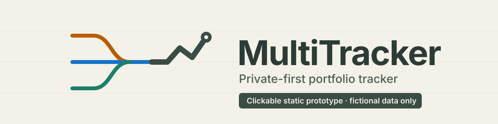
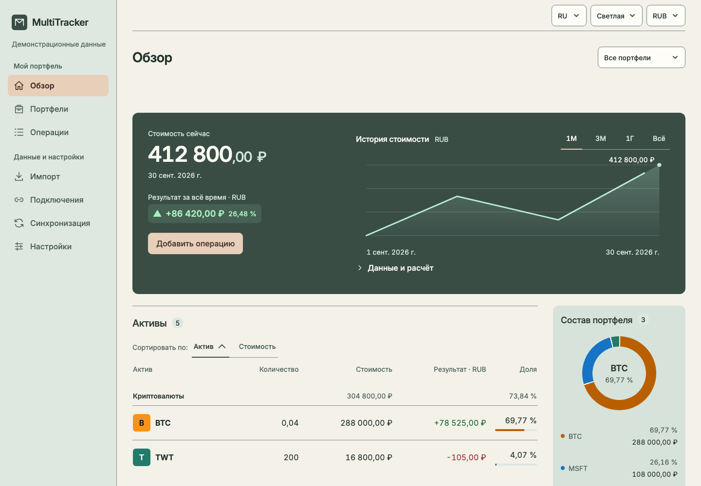

<p align="center">
  <picture>
    <source media="(prefers-color-scheme: dark)" srcset=".github/assets/banner-dark.svg">
    
  </picture>
</p>

<p align="center">
  <a href="https://github.com/apolenkov/multitracker/actions/workflows/check.yml"></a>
  <a href="LICENSE"></a>
  <a href="https://apolenkov.github.io/multitracker/"></a>
  
  
</p>

# MultiTracker

Статический кликабельный макет приватного трекера портфелей на React, TypeScript и Vite:
семь разделов, русский и английский, вымышленные данные и никаких внешних служб.

<p align="center">
  
</p>

[Открыть демо](https://apolenkov.github.io/multitracker/) — это тот же статический макет
на вымышленных данных; публикация не подключает API, хранение или шифрование.

> [!WARNING]
> Не вводите реальные финансовые данные, пароли и ключи. В макете нет сервера, базы,
> настоящих котировок, API, загрузки файлов, хранения и шифрования.

## Зачем

Макет показывает полный интерфейс будущего приложения для учёта портфелей до начала настоящей
реализации: можно пройти все экраны, формы и состояния и проверить их на телефоне и на
рабочем столе. Приватность и локальность данных — исходное требование продукта; будущая
реализация описана в [дорожной карте](docs/plans/2026-09-30-roadmap.md).

## Возможности

- Семь разделов: **Обзор, Портфели, Операции, Импорт, Подключения, Синхронизация, Настройки**.
  Разделы «Рынки», «Избранное», «Аналитика» и «События» убраны из текущего объёма; полная
  версия из одиннадцати разделов сохранена тегом `prototype-full-11-sections`.
- Язык RU/EN; валюты расчёта и показа выбираются отдельно из RUB/USD.
- Светлая тема по умолчанию (палитра Bentley: холст `#f3f1e8`, Race Green `#394d45`),
  тёмная и системная темы, монохром по выбору, предпросмотр виджета портфеля в настройках.
- На телефоне четыре пункта навигации: Обзор, Портфели, Операции, Ещё.
- Tradernet, Binance и Bybit представлены вымышленными примерами.
- Формы принимают временный ввод и показывают демонстрационный результат. Черновики и
  настройки живут в памяти вкладки; перезагрузка возвращает исходное состояние.
- Строгий TypeScript (`strict`, `noUncheckedIndexedAccess`, `exactOptionalPropertyTypes`),
  ESLint и Oxlint с проверкой доступности JSX, проверки интерфейса через agent-browser.

## Запуск

Нужен Node.js **26.10.0** (закреплён в [.nvmrc](.nvmrc)).

```sh
git clone https://github.com/apolenkov/multitracker.git
cd multitracker
nvm install && nvm use
npm ci
npm run dev
```

Откройте адрес Vite, обычно `http://127.0.0.1:5173`. Сервер слушает только локальный интерфейс.
`npm run build` создаёт `dist/`, `npm run preview` показывает сборку.

## Использование

1. В верхней панели выберите язык (RU/EN), тему и валюту показа.
2. Переходите по разделам в боковом меню (на телефоне — в нижней панели).
3. Откройте любую форму, например «Добавить операцию»: сохранение показывает демонстрационный
   результат и не меняет фиксированные примеры. Экспорт файл не создаёт, подключение и
   синхронизация запросов не отправляют.

## Конфигурация

Переменных окружения и конфигурационных файлов приложения нет: язык, тема, валюты и монохром
переключаются в интерфейсе и хранятся только в памяти вкладки. Версия Node.js — в
[.nvmrc](.nvmrc), зависимости закреплены в `package-lock.json`, отображаемый адрес сервера — в
скрипте `dev` ([package.json](package.json)).

## Разработка

```sh
npm run check
```

Полная проверка: Prettier, типы (TypeScript 7 и 6), сложность, самопроверка запретов,
тесты `node:test`, сборка, аудит зависимостей и поиск секретов. Для последнего нужен
**Gitleaks 8.30.1** из [официального выпуска](https://github.com/gitleaks/gitleaks/releases/tag/v8.30.1).
Проверки интерфейса (`npm run test:ui`, `npm run test:smoke`) требуют запущенного сервера.

Хуки Git необязательны: `npx lefthook install` включает pre-commit (форматирование и линтеры),
commit-msg (commitlint) и pre-push (`npm run check`). Правила участия — в
[CONTRIBUTING.md](CONTRIBUTING.md), безопасность — в [SECURITY.md](SECURITY.md), вопросы — в
[SUPPORT.md](SUPPORT.md).

Подробности, которых нет на этой странице:
[полная таблица проверок и история результатов](docs/project-status.md),
[DESIGN.md](DESIGN.md) (карта интерфейса и палитра),
[текущее оформление](docs/design/current-style.md),
[план полного макета](docs/plans/2026-09-30-complete-prototype.md),
[сводка готовности](docs/reviews/prototype-readiness.md),
[передача работы](docs/agent-handoff.md).

```text
src/        интерфейс и стили (model/ — учебная арифметика, forms/, records/, insights/, demo/)
tests/      проверки поведения
scripts/    проверки инструментов и правил
docs/       требования, планы, решения, исследования
openspec/   спецификации макетов
public/     статические материалы и лицензии зависимостей сборки
```

## Лицензия

Код — [MIT](LICENSE). Лицензии React, React DOM, scheduler и локального Inter 4.1
(SIL Open Font License 1.1) сохранены в [THIRD_PARTY_NOTICES.txt](public/THIRD_PARTY_NOTICES.txt).
У сторонних материалов отдельные права.
